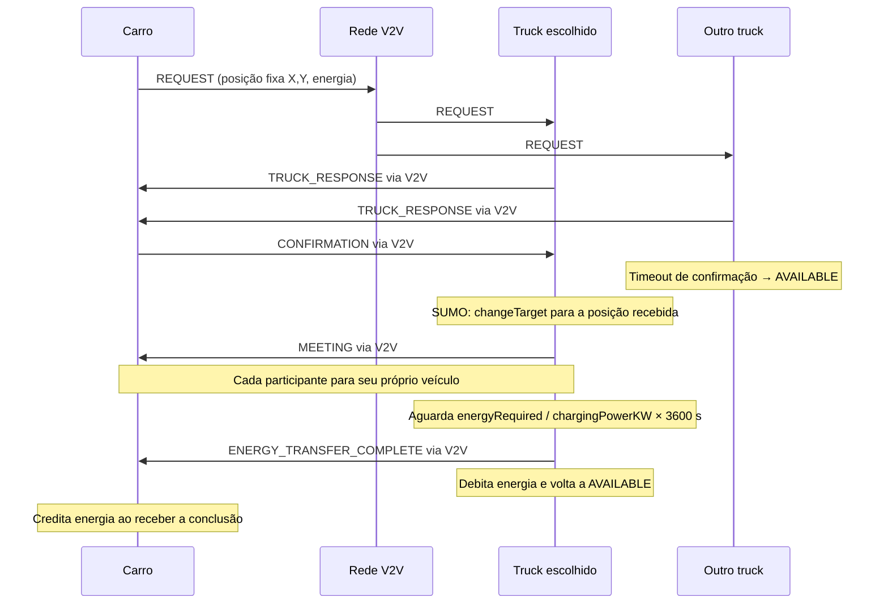

# Battery Truck: confirmação, destino fixo e carregamento em kW

Esta etapa usa OMNeT++ 6.3.0, Veins 5.3.1 e SUMO 1.22.0 no workspace
`opp_env`, que também contém INET 4.6.0. A comunicação do cenário permanece
na pilha 802.11p do Veins; INET não foi introduzido como uma segunda pilha.

## Estrutura e alterações incrementais

`EnergyProtocolApp` continua responsável pelo broadcast, cache, TTL,
`originAddress`, `messageId`, `previousHopAddress`, `hopCount` e `hopLimit`.
Esses mecanismos foram preservados. Os logs detalhados de encaminhamento
podem ser habilitados por `logNetworkDetails`; os logs de atendimento estão
habilitados por padrão em `battery.ini`.

`EnergyRequestApp` mantém bateria, solicitação e estado do carro.
`BatteryTruckApp` mantém o atendimento exclusivo e os temporizadores.
`FixedDestinationMobility` encapsula as chamadas de mobilidade do próprio
caminhão. `BatteryState`, `MessageCache` e `EnergyRequestStats` permanecem
na infraestrutura existente.

O esboço mencionado no pedido não correspondia inteiramente aos arquivos no
início desta etapa: já havia aplicações separadas e um fluxo de anúncios e
recibos. Esse fluxo foi substituído pelo fluxo simples solicitado.
`EnergyResponse.msg` já havia sido removido na limpeza anterior. O envelope
`EnergyRequest.msg` existente foi reutilizado, sem criar outro equivalente.

## Mensagens e estados

Há somente cinco tipos em `EnergyMessage`:

1. `Request`: pedido com energia, identidade, prazos e posição congelada.
2. `TruckResponse`: caminhão disponível, aguardando confirmação.
3. `Confirmation`: carro escolhe a primeira resposta válida, sem ranking.
4. `Meeting`: caminhão chegou ao destino fixo; informa início/fim da carga.
5. `Transfer`: carregamento concluído e quantidade debitada no caminhão.



Estados do caminhão: `AVAILABLE`, `WAITING_CONFIRMATION`, `GOING_TO_REQUEST`,
`MEETING` e `CHARGING`. A confirmação deve corresponder a requester, requestId,
truckId e destino lógico. Um temporizador explícito implementa o timeout;
uma confirmação válida o cancela. Só então o caminhão altera sua rota.
Um caminhão ocupado não aceita outro atendimento. Não há fila.

O identificador do pedido é `(requesterId, requestId)`. Nos REQUESTs,
`requesterId == originAddress`. Nas demais mensagens, `originAddress`
identifica quem criou o frame e `requesterId` conserva a identidade do pedido.
Nos logs de atendimento, `originAddress` sempre identifica o solicitante.
A chave de deduplicação dos frames continua `(originAddress, messageId)`.

As respostas iniciais usam o jitter já configurado para reduzir colisões de
respostas simultâneas. Isso não compara caminhões ou altera a regra de escolha.
Reanúncios do pedido conservam a mesma posição, energia e prazo, mesmo com o
carro em movimento. Não há atualização contínua do destino.

## Mobilidade e encontro

O REQUEST transporta `positionX/positionY` no sistema de coordenadas do Veins.
O caminhão copia esses valores uma única vez para `destination`. Depois da
confirmação, o adaptador usa APIs verificadas na instalação local:

- `TraCICommandInterface::getRoadMapPos(Coord)`: converte a coordenada recebida
  para edge e posição longitudinal, incluindo a transformação Veins/SUMO.
- `Vehicle::changeTarget(edge)`: solicita ao SUMO a construção da rota.
- `Vehicle::setSpeed(0)`: para o próprio veículo durante o carregamento.
- `Vehicle::setSpeed(-1)`: devolve o controle normal da velocidade ao SUMO.
- `getPlannedRoadIds`, `getRoadId`, `getLanePosition` e `changeVehicleRoute`:
  consultam/controlam somente o próprio caminhão, para tratar destino atrás
  em via de mão única e retornar à sua rota de circulação.

Se o ponto está atrás na mesma edge, o caminhão continua até sair dessa edge
antes de pedir ao SUMO uma rota de retorno. Não há teletransporte, previsão,
perseguição, interceptação ou algoritmo próprio de otimização de rotas.
Depois do serviço, ele retoma sua rota própria; pode primeiro voltar a uma
edge dessa rota quando o atendimento ocorreu fora dela.

`MEETING` é a primeira amostra de mobilidade com distância euclidiana do
caminhão à **posição histórica do REQUEST** menor ou igual a `meetingDistance`.
A aplicação não consulta a posição atual de outro veículo. O carro continua
circulando até receber MEETING, quando para onde estiver; não é reposicionado.
O caminhão para quando detecta a chegada. O SUMO mantém sua dinâmica normal
na desaceleração. Não há escolha de faixa ou manobra de estacionamento.

**Consequência deliberada deste experimento:** no urbano, o carro pode ter se
afastado da posição histórica. MEETING comprova chegada à coordenada pedida,
não necessariamente proximidade física entre os dois veículos naquele instante.
A transferência é a abstração lógica solicitada. A métrica
`requesterDisplacementAtMeeting` expõe esse afastamento. No cenário mínimo,
o carro anda lentamente e permanece próximo do ponto, permitindo verificar o
fluxo completo também com proximidade física.

## Bateria e temporização

Por padrão, os carros têm capacidade de 80 kWh e energia inicial sorteada
uniformemente entre 16 e 40 kWh. `initialBattery = -1` seleciona o sorteio;
um valor não negativo fixa a energia para testes reproduzíveis.
O pedido é gerado abaixo de `lowBatteryThreshold` e calculado por:

```text
energyRequired = batteryCapacity × targetBatteryPercent / 100 − energiaAtual
chargingSeconds = energyRequired / chargingPowerKW × 3600
```

O caminhão tem 500 kWh e potência padrão de 100 kW. Ele responde somente se
possui toda a energia solicitada. Não há perdas ou curvas elétricas.
O evento de conclusão é agendado para o fim calculado, sem progresso periódico
ou redução artificial da duração. Durante CHARGING, o consumo abstrato do carro
é suspenso. Antes do encontro, pode haver consumo após a criação do pedido;
por isso a carga final pode ficar ligeiramente abaixo do alvo originalmente
calculado no cenário urbano.

Exemplo validado: 20 kWh / 100 kW = 720 s. O caminhão passa de 500 para 480 kWh;
o carro do teste mínimo passa de 20 para 40 kWh. Com 40 kWh, são 1440 s.

Ao terminar, o caminhão debita uma única vez, envia Transfer e retorna a
AVAILABLE. O carro só credita um atendimento selecionado, em CHARGING, após
a data prevista; seu estado impede crédito duplicado. **Não há Receipt,
rollback nem confirmação de conclusão.** Se a mensagem final for perdida,
o caminhão pode ter debitado sem o carro creditar. Os testes e métricas
registram separadamente energia debitada e recebida; não inventam confirmação.

`requestLifetime` limita descoberta/deslocamento, não o carregamento já
iniciado. Ao receber MEETING, o carro aguarda até o fim anunciado mais TTL e
um tick. Se a conclusão não chegar, expira o pedido e libera sua velocidade.
Pedidos pendentes no fim da simulação são registrados separadamente.

## Cenário de 50 carros + 2 caminhões

`sumo/battery_two_trucks.rou.xml` contém dois veículos de tipo `batteryTruck`,
com IDs e rotas longas diferentes, construídas usando as conexões do `.net.xml`.
O cenário urbano carrega esse arquivo junto com `grid9x9_50.rou.xml`.
As 50 rotas originais não foram alteradas:

```text
SHA256 grid9x9_50.rou.xml:
708e49803f9f2058fc02d8eb148bab44b3e1b0626165d2aa9467e46dcb8900b7
```

O manager mapeia o vType `batteryTruck` para `truck[]` com `BatteryTruckApp`;
os outros tipos usam `node[]` com `EnergyRequestApp`. Nenhum papel é decidido
por ID ou índice no C++. Os índices são dinâmicos: no urbano não se deve
presumir que os caminhões sejam truck[0] e truck[1].

O SUMO tem limite de 7200 s, e o experimento urbano OMNeT++ usa 1800 s.
O teletransporte automático por espera foi desabilitado nesses cenários para
não mover veículos durante as paradas longas. Os fixtures mínimos foram
adaptados somente para testes; o arquivo dos 50 carros permanece intacto.

## Configuração

Valores principais estão explicitados em `omnetpp.ini`, e os cenários em
`battery.ini`, que inclui o primeiro arquivo. Defaults ficam nos NEDs.

| Aplicação | Parâmetros |
|---|---|
| Carro | batteryCapacity, initialBattery, initialBatteryMin, initialBatteryMax, targetBatteryPercent, lowBatteryThreshold, consumptionRate |
| Caminhão | batteryCapacity, initialBattery, chargingPowerKW, meetingDistance, responseTimeout |
| Comunicação | messageTtl, maxHops, forwardJitter, logNetworkDetails |
| Temporização | tickInterval, requestInterval, requestLifetime |

Exemplos: `*.node[*].appl.initialBatteryMin = 16`,
`*.truck[*].appl.chargingPowerKW = 100`,
`*.truck[*].appl.responseTimeout = 5s`.

## Compilar, executar e filtrar logs

Na raiz do projeto:

```bash
opp_env run -w .. --no-build -c 'make -j$(nproc)'
# O executor inicia e encerra seu próprio launchd em uma porta disponível.
opp_env run -w .. --no-build -c 'python3 scripts/run_battery.py BatteryUrban'
# Sem argumento, o executor também seleciona BatteryUrban.
opp_env run -w .. --no-build -c 'python3 scripts/run_battery.py BatteryMinimal'
# Validação automática dos nove cenários desta etapa
opp_env run -w .. --no-build -c 'python3 scripts/test_battery.py 0'
```

Para salvar o log urbano e demonstrar o fluxo:

```bash
mkdir -p results/battery
opp_env run -w .. --no-build -c 'python3 scripts/run_battery.py BatteryUrban' > results/battery/urban.log 2>&1
grep -E 'REQUEST_SENT|REQUEST_RECEIVED|TRUCK_RESPONSE_SENT|REQUEST_CONFIRMED|TRUCK_CONFIRMATION_RECEIVED|TRUCK_DESTINATION_SET|TRUCK_GOING_TO_REQUEST|TRUCK_MEETING|MEETING_REACHED|ENERGY_TRANSFER_STARTED|ENERGY_TRANSFER_COMPLETED|TRUCK_AVAILABLE|TRUCK_RESPONSE_TIMEOUT' results/battery/urban.log
# Após executar a matriz, acompanhar um pedido completo do cenário mínimo:
grep -E 'originAddress=17 requestId=1' results/battery/BatteryMinimal-seed0.log
# Detalhes do broadcast, se necessários para depuração:
opp_env run -w .. --no-build -c 'python3 scripts/run_battery.py BatteryMultihop --**.appl.logNetworkDetails=true' > results/battery/multihop.log 2>&1
grep -E 'REQUEST_RECEIVED|REQUEST_FORWARDED|REQUEST_DROPPED_DUPLICATE' results/battery/multihop.log
```

Os IDs no segundo grep são somente os observados nesse teste com semente 0;
não são usados na aplicação para selecionar papéis ou parceiros.

`cmdenv-express-mode=false` permite logs; `cmdenv-event-banners=false` remove
banners de eventos internos. Só a aplicação usa nível INFO; a infraestrutura
usa WARN. Não há logs periódicos de progresso do carregamento.

Para regenerar as rotas controladas após editar os pontos de passagem:
`python3 scripts/prepare_battery_scenarios.py`. O gerador não reescreve o
arquivo original de rotas dos 50 carros. Os launch files usam `basedir=sumo`;
o executor sempre ajusta o diretório de trabalho para a raiz.

## Resultados e arquivos

[Validação e evidências](battery-validation.md),
[resultados estruturados](battery-test-results.json) e
[inventário de alterações desta etapa](battery-files.md).

Os scalars/vetores continuam registrando bateria inicial/final, energia
consumida/solicitada/recebida/fornecida, pedidos atendidos/expirados/pendentes,
respostas/timeout, encontros, tempo de viagem, duração planejada e observada,
mensagens, latência, hops, retransmissões, duplicatas e TTL.
`EnergyRequestStats` mantém a agregação da rede por signals.
